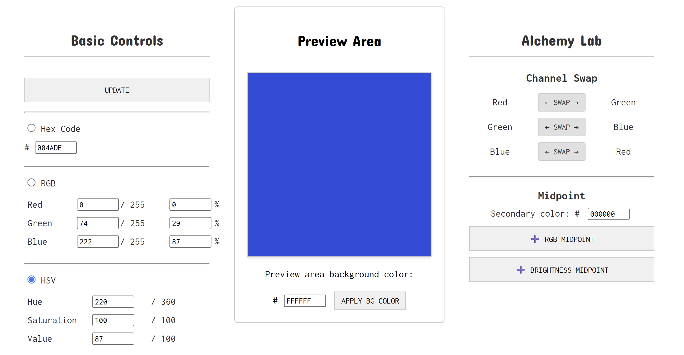

# Color Synth Lite

A lightweight offline tool for hex color experiments

## Purpose

Tired of launching a program just to shift the hue of an RGB hex color? **Color Synth Lite** is a zero-load browser tool for testing variation, blending colors (RGB or brightness), or swapping channels—Designed for fast, incremental, and iterative color tweaks.

## Screenshot

## Usage

Go to the [live page]() for a demo, or download [index.html](index.html) and run it locally.

1. Enter values in Hex, RGB, or HSV; hit **UPDATE** to preview.
2. Use **Alchemy Lab** for channel swaps and midpoints between colors.
3. Click the preview square to copy the current color's hex code.

## License

This tool is released under the [MIT License](LICENSE).

## About

**X**: [@5ynthaire](https://x.com/5ynthaire)  
**GitHub**: [https://github.com/5ynthaire](https://github.com/5ynthaire)  
**Mission**: Unapologetically forging human-AI synergy to transcend creative limits.  
**Attribution**: Created with Grok by xAI (no affiliation).
